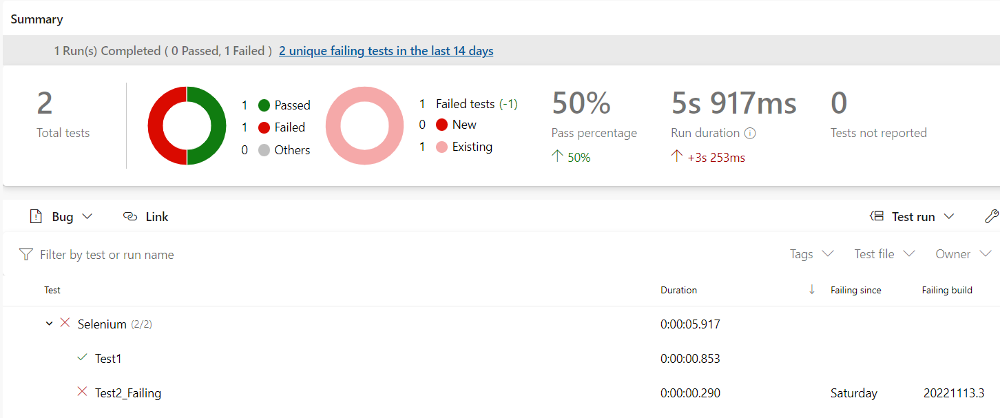
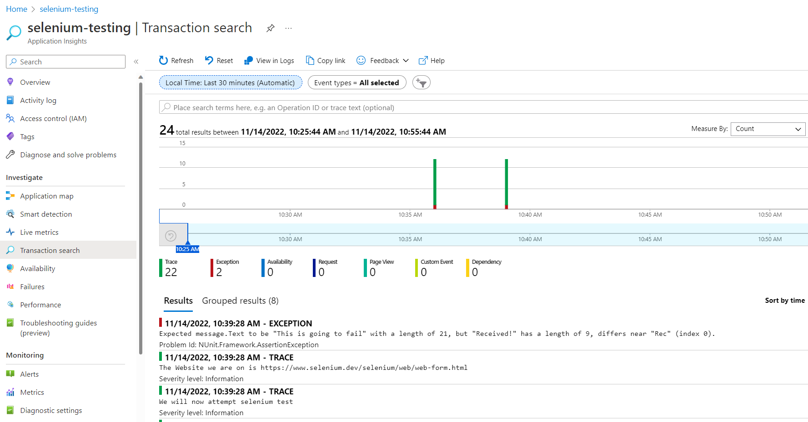

# About
Running `NUnit` tests with results logged in Application Insights.

## How to
Tests are configured to use `APPINSIGHTSCONNECTIONSTRING` environment variable for Application Insights Connection String.

## Results

